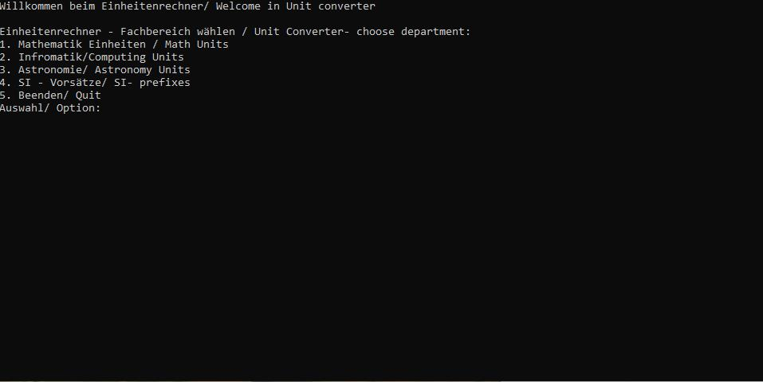
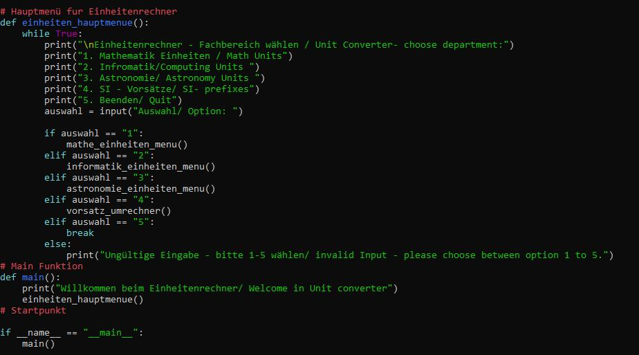

# Python Unit-Converter — Python Mathematik-Rechner  
** ©2025 BEG, B.E.G.-System™ Core Tool (Source-Available Licensed Software)**

This is a ready to use python tool for converting different kind of units.
The code is modular build can can be further deveolpt for you own Projects.
It's ideal for developers, students and educational purpose.
Can be integrated into Python projects or used as a standalone CLI tool.  
Ideal for learning, prototyping, research and embedded applications.

Function:
- Menu service through console
- uniform structure with clear logic
- extendebale für further units / departments
- usable for education, commercial and privat usage, perhaps siencetific usage

Download / Fullversion:

The complete Zip - Version inclusive all the files is obtainable under:
https://babhuegoa.gumroad.com/l/yhrfs

After purchase you can use the code without restriction and for you own projects, 
under the B.E.G.-System Core Tool license terms.

Usage:
You will need Python 3.11 or an Python 3.x Version to start the code via
Python itself or double click on the codefile and if you have the right pytohn version it should start.
Within Python you need to type: python3 mathUm_friverr.

General Information:
The Repository is an public dokumentaion und prieview. The working ZIP-Version can be obtian 
through gumroad.

License:

This project works under the: B.E.G.-System Core Tool License / B.E.G. Basiswerkzeug Lizenz
- commercial usage allowed
- Notice "Based on the B.E.G.-Sytsem from Emanuel Goas" needed
- Passing of the originalcode itself to others is not allowed
- For more details look in "License / Lizenz " file in the repository
Thank you for you attention

News and Information:

If you want to get news about my Project and like to be well informed you can suscribe to my Gumroad channel. All news and Procejt information will be first send and published there. link: https://babhuegoa.gumroad.com/subscrib

Prieview:

Repository Purpose:

This repository serves as public documentation and preview. The runnable ZIP version is distributed exclusively via Gumroad.

